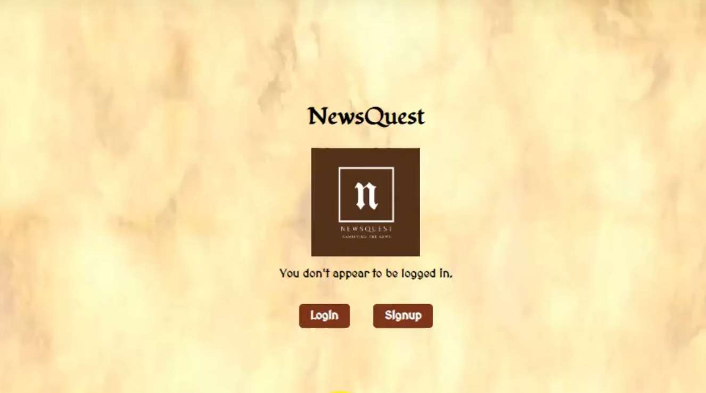
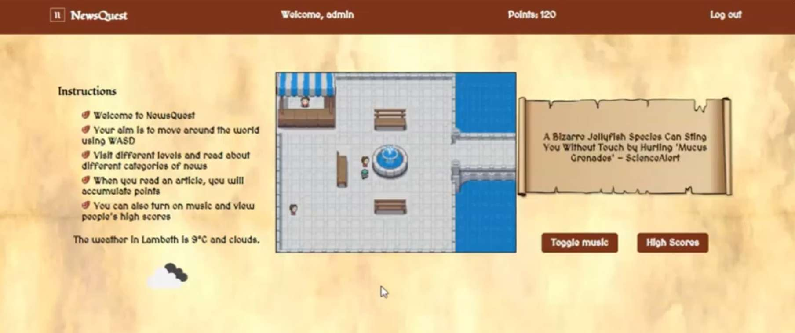

# NewsQuest

[Dan Ledwos](https://github.com/Ledwos) |
[Christopher King](https://github.com/seekingcode18)


## Overview
This was the final project for our coding bootcamp, Futureproof. We had 5 days to produce a fully functional web application with authentication, testing and a polished user experience.

Our aim was to engage young people in the news. We both experienced a lack of interest in current affairs when we were younger so we decided to gamify the news and award points to players when they read an article.


## Contents
[Installation](#installation) |
[About](#about) |
[User Stories](#user-stories) |
[Technologies](#technologies) |
[Methodologies and Processes](#methodologies-and-processes) |
[Reflections](#reflections) |
[Testing](#testing) |
[Extras](#extras)


## Installation
* Assuming you have Python 3 and PIP installed:
* ```pip install django```
* ```pip install django-cors-headers```
* ```pip install django-rest-framework```
* ```git clone https://github.com/Ledwos/NewsGameProject.git``` into a new directory
* Navigate into the repo you just cloned
* ```cd newsgame```
* ```python manage.py test``` to see the 18 tests passing
* ```python manage.py runserver```
* Navigate to ```localhost:8000``` in your browser to begin




## User Stories
1. As a user, I want to play a fun, interactive game so that I become more engaged with the daily news
2. As a user, I want to register as a new user in order to be able to play
3. As a user, I want to log in so I can have personalised experience
4. As a user, I want to be able to use the keyboard to move my player around the screen
5. As a user, I want to interact with NPCs on the screen in order to read news headlines
6. As a user, I want to click on a headline to read the full article in a new tab
7. As a user, I want to accumulate points as I read the headlines
8. As a user, I want to move through a maze and exit in order to finish reading my articles
9. As a user, I want to traverse a world map in order to choose what type of news I want to read
10. As a user, I want to see a list of high scores on a leaderboard in order to compare myself to other users
11. As a user, I want to be able to log out in order to end my session
12. As a user, I want to be able to keep my score from my last session when logging into a new session
13. As a user, I want to have the option of different topics of news in order to choose what I want to read
14. As a young user, I want to have a method of authentication during sign up process so my parents have to give me permission to sign up


## Technologies
* Python
* Django
* Django Rest Framework
* unittest
* HTML
* Jinja2
* CSS
* JavaScript
* SQLite
* Canvas API
* News API
* Geolocation API
* Open Weather Map API
* Sprites and background music (from [Open Game Art](https://opengameart.org/))


## Methodologies & Processes
We started by brainstorming ideas and settled on making a game to engage young people in the news. We thought this was a problem worthy of our attention as we both experienced a disinterest in the news when we were younger and noticed the same in our peers. We decided a very simple MVP was best given the short time frame (1 week). This MVP was to let a user log in, move a character around a maze, and encounter other characters who would read them the news headlines.




## Reflections
This was a really fun project to work on. We achieved a very basic MVP after 2 days and then set about improving it and working on incremental goals, including: collision detection, a persistent score, a leaderboard of highscores, localised weather forecast and topically sorted news articles. We ran into a few challenges throughout the week including working with relative URLs in Django, connecting to the database, and working with sprites in the canvas, but these were all overcome by perseverance, research and reading the documentation. This has made us excited to create more games in the future as a fun way of improving our coding abilities.


### Testing
We were able to achieve decent backend testing coverage using unittest to test the majority of our views, models and URLs. We didn't have time to test the frontend JavaScript but probably would have used Mocha & Chai. We would seek to test that the following:
* map is drawn correctly after the start() function is called
* player's position properties are updated when keys are pressed
* score increments when player reads the news (stands on given blocks)
* that the results of the API call are stored correctly, ready to be displayed


## Extras
If we had more time, we would have liked to implement the following features:
* More variety in gameplay, e.g. more levels, dangers or enemies that deduct points, dynamic spawn points, customisable characters, levels & ribbons, in-game weather
* Getting news from user's location via geolocation
* Animation & smooth movement with several refreshes per second rather than once per key press
* Retrieving the news by web scraping (this was a stretch goal - we got a basic scrape working but weren't able to categorise it since BBC Newsbeats didn't display categories on its home page)
* Natural language processing to scan the text of a news article and identify key words to display under the headline
* More advanced user authentication (we implemented a tick box to check parent permission as credit card verification was deemed out of scope for this project; we like the idea of using knowledge-based age verification where the sign up page redirects to a parent's permission page for parents to answer common questions about history, economics and politics that children wouldn't know or be able to easily Google)
* We would test more of the front and back end functionality to increase the number of tests from 18
